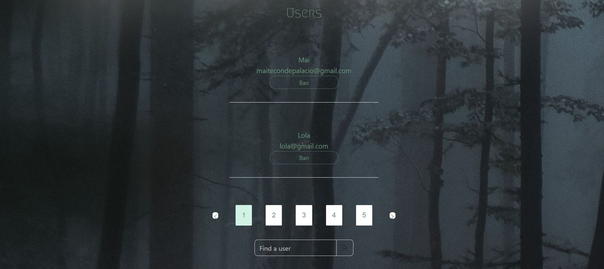

# Escape-Fear
Aplicación web que simula el servicio de reservas de escape rooms, puedes ver las salas, reservarlas y valorarlas (comentarios con puntuación).
Si eres Admin, puedes acceder a la vista que te pemrite editar, crear y borrar salas, admeás de banear (y recuperar) usuarios. Esta vista está protegida con guards, al igual que la de perfil o la posibilidad de reservar sin estar conectado.
Además de esto, hay un formulario de contacto y una vista About con información sobre las salas y Escape-fear.
## Tecnologías utilizadas :hammer_and_wrench:
>Este proyecto esta creado con React en el frontend y Antd como framework de css. Y con PHP Laravel en el backend y MySQL como base de
datos.
#### Preview
Vista de home:

Vista perfil:

Aquí se ve como puedes crear una reserva:

 Podemos ver el detalle de las salas: 

Vista de Admin, donde puedes tratar con las salas y los usuarios: 
 

 
Página 404:

Vista de about:

